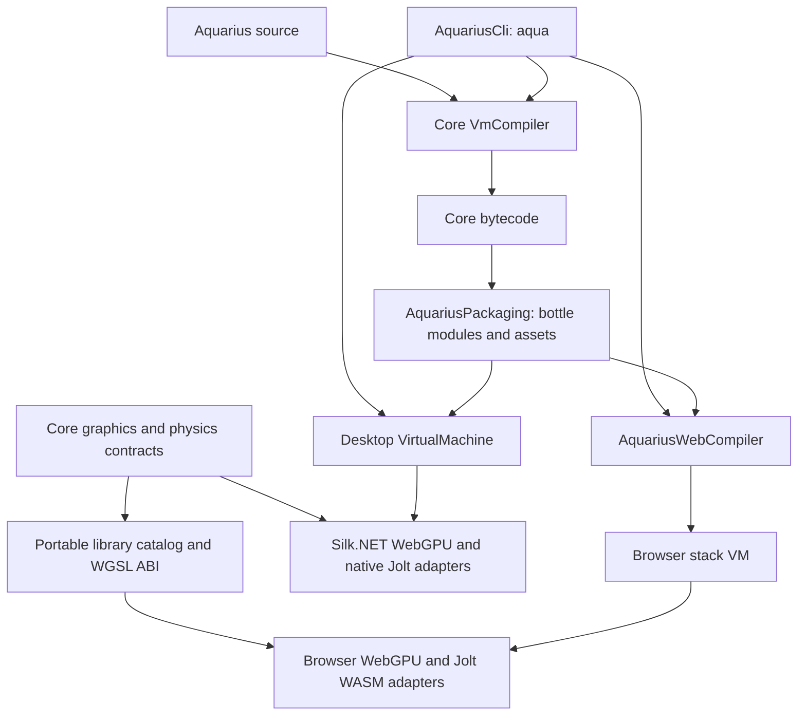

# Shared VM hosts and browser compilation

Core owns `IWgpuBackend`, device/buffer/shader/render-target contracts, WGPU module registration, validation, aliases, shader declarations and the 1,120-byte Processing uniform ABI. Desktop implements these interfaces with Silk.NET and wgpu-native. Its window and Processing implementation remain host-specific, and use the shared shader ABI. GPU resources remain owned by devices; cross-device resources and use after disposal are rejected.

`AquariusCli` is the compiler driver. `build` compiles explicitly listed source
modules and assets into a portable bottle; `run` loads that bottle on the desktop;
`build package.bottle --target web` exports the same compiled modules to the
browser without parsing or executing sources. Existing desktop and web entry
points remain compatible. The legacy source-based web command first constructs
a bottle through the shared packaging pipeline.

`AquariusPackaging` depends only on core. New version 2 manifests declare modules,
assets, the default entry and the RIUS version; version 1 bottles remain readable.
Both hosts normalize `.aqua` imports to packaged `.rius` modules and reject
escapes. Repeated script imports create independent globals on both hosts.
Native modules remain shared per run. Desktop resources are materialized in a
private temporary directory for native readers and removed when the run ends;
virtual module directories and output file paths remain relative to the relocated
bottle. The browser uses its bundled virtual filesystem. Package and website
builds stage their output and preserve prior artifacts on failure.

See [the package specification](AquariusPackaging/README.md) and
[the unified CLI guide](AquariusCli/README.md) for limits, commands and tests.

Core also owns `IPhysicsBackend`, `IPhysicsWorld`, and the Jolt module API. Native Jolt is retained in the desktop adapter, where factory lifetime and calls are serialized. Moving native DLL dependencies into core would make browser deployment depend on desktop binaries, so core shares the API and validation rather than a native package. Jolt itself supports Windows, Linux, macOS and WebAssembly; the browser adapter uses the upstream [JoltPhysics.js port](https://github.com/jrouwe/JoltPhysics.js), pinned at 0.24.0.

Both hosts allow 4,096 bodies. The browser uses 8,192 body pairs and 4,096 contact constraints so that updates fit the pinned WASM port's temporary allocator; desktop retains 65,536 pairs and 16,384 constraints. These capacities affect dense collision scenes, and exhaustion reports an error. Numerical tolerances are tested rather than assuming identical floating-point results across native and WASM builds.

The website compiler serializes core instructions and typed constants to versioned JSON. The JavaScript interpreter uses explicit frames and lexical scopes, preserving integer/float/double arithmetic, closures, module exports, loops and bilingual function declarations. Browser host calls can await GPU mapping, physics initialization and animation frames without blocking input. Shared library metadata supplies both aliases and argument counts. Shared WGSL sources and field alignment keep custom shaders portable across hosts.

Each generated site includes modules and assets in a virtual filesystem, plus local copies of pinned Jolt WASM, matrix and triangulation dependencies with their licenses. Runtime imports cannot read outside the package. Rendering capability failures and unsupported APIs produce explicit errors. Static output requires localhost or HTTPS and a browser WebGPU adapter. The web runtime does not emulate physics or GPU computation when those capabilities are unavailable.

See [the compiler README](AquariusWebCompiler/README.md) for build, serving and verification commands. The current example programs and marble-run are the compatibility target; this does not claim that every desktop library function is already available in browsers.
