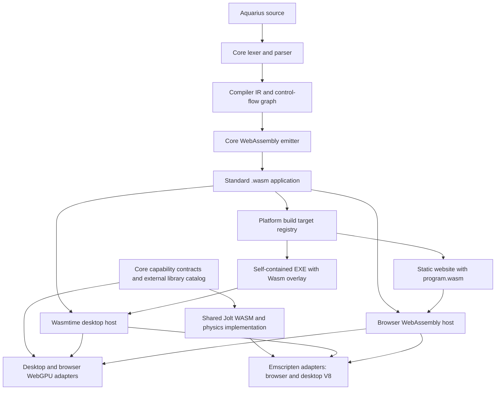

# WebAssembly compiler and cross-platform hosts

Aquarius is a compiled language. The front end lowers syntax to compiler-only IR,
then emits standard WebAssembly functions and control flow. No Aquarius instruction
stream, AST interpreter or opcode dispatcher is deployed. Dynamic values, lexical
bindings, arrays, hashes, closures and platform capabilities are supplied by the
versioned `aquarius_v1` host ABI. A future optimizer can specialize dynamic value
operations without changing platform APIs or the application format.

Each compiled function exports `aqua_fN(i32 continuation) -> i32`. Compiled basic
blocks use structured Wasm branches and `br_table`; host imports implement value
operations rather than interpreting instructions. A nonnegative result is a
continuation; -1 completes the function. Calls and member resolution suspend at
compiler-generated boundaries. Hosts schedule compiled function frames without
using the C# or JavaScript call stack for Aquarius recursion. Browser host calls
can await GPU mapping, external-library initialization and animation frames.
Checkpoints bound each browser turn and make cancellation observable in pure loops.
Every execution owns its value frames and imports, including callback reentry.

Hosts trace active language scopes, operands, suspended native arguments and
callback closures at frame boundaries to reclaim unused Processing canvases and
images. Extracted native methods retain their resource scope. Host ownership
registries are not roots, and failed/completed executions release their roots.
Processing's optional `error` event handles input callback failures on both hosts;
`errorEvent` and `errorMessage` describe the failure. Unhandled failures, failures
in the error handler and browser cancellation still terminate execution.

A `.wasm` file contains executable Wasm sections and exactly one
`aquarius.application` custom section: ABI version, module/function mapping,
constants, function metadata and base64 assets. Module identities retain their
source-relative `.aqua` names; source contents are absent. Application loaders
bound sizes and reject malformed metadata and unsafe paths. Engines independently
validate Wasm types and code. Repeated script imports create independent globals;
registered native modules are shared within a host session. Closures retain their
module environment and builtins for deferred imports.

`AquariusPackaging` depends only on core. It compiles modules and resources directly
into the Wasm application and stages output before replacement. `.bottle` and
`.rius` are retired; old applications must be recompiled from source.
`AquariusCli` can build Wasm, websites and EXEs directly from sources, or export a
previously compiled Wasm application. Compilation and export never execute code.

`AquariusBuild` registers targets through `IWasmBuildTarget`; new platforms do not
change CLI parsing. Windows deployment preserves the self-contained runtime-pack
design and checksummed executable overlay. Overlay version 2 contains Wasm plus
entry metadata; runtime packs declare the Wasm ABI version. The application host
runs the embedded module through Wasmtime. Runtime packs are rebuilt by release
tooling, and generated applications need no installed SDK or .NET runtime.

Core retains `IWgpuBackend`, device/buffer/shader/render-target contracts, validation,
aliases, shader declarations and the 1,120-byte Processing uniform ABI. Desktop
uses Silk.NET and wgpu-native; browsers use WebGPU. Devices own GPU resources and
reject foreign or disposed handles. Window integration remains host-specific.
OpenGL remains available for compatibility with existing examples; future main
graphics implementations use the core WebGPU boundary.

Core also owns external library descriptors, pinned versions, contracts and portable
assets. JoltPhysics.js 0.24.0 is an Emscripten module requiring JavaScript glue.
Both platforms execute the same binary and shared world code embedded by core;
desktop supplies ClearScript/V8 for Emscripten while Aquarius itself uses Wasmtime.
The C# Jolt binding and joltc binaries are removed. Both hosts use the same physics
capacities and validate behavior with numerical tolerances. See
[external libraries](docs/external-libraries.md) for extension rules and profiles.

Application contracts and language registration remain in `AquariusCore/application`.
Adapters provide file resources, codecs, clipboard, windows/input, fonts, persistence
and host services. User documents retain opaque provider identities, separate from
bundled assets. Desktop assets are materialized in a private temporary directory
and cleaned up with the runtime; writable output paths remain relative to the
relocated application. Browsers use a virtual filesystem. See the
[application API](docs/application-libraries.md).

Validation includes language semantics through Wasmtime, Wasm round trips and
corruption, deep recursion, async browser calls/cancellation, callback reentry,
desktop/browser execution of identical binaries, shared Jolt numerical tests,
source-free imports/assets, CLI and standalone EXE smoke tests, and opt-in desktop
and browser WebGPU regressions. The example scripts and marble-run remain the
compatibility target.
