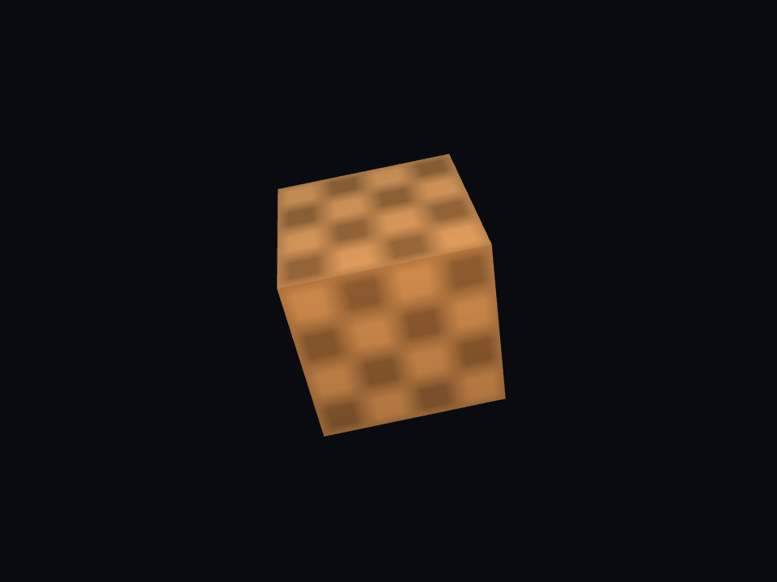

# 旋轉材質立方體 / Rotating material cube



`main.aqua` is a complete Aquarius OpenGL 3.3 application. The Aquarius source
owns its 24 position/normal/UV vertices, 36 indices, GLSL shaders, texture upload,
material uniforms, camera matrices, lights, animation loop and resource cleanup.
There is no built-in cube renderer or host-side animation.

The material uses a checker texture decoded by stb_image, ambient/diffuse/
specular reflectance and Blinn–Phong shininess. An orbiting warm point light
uses distance attenuation, with a cool directional fill. Normals use the inverse
transpose model matrix. The texture is sampled as sRGB and output is gamma
corrected. The cube rotates about a tilted axis with time-based motion.

From the repository root, after building the native library:

```powershell
./native/build.ps1
dotnet run --project AquariusDesktopVMREPL -- AquariusDesktopVMREPL/examples/opengl_cube/main.aqua
```

Press **Esc** or close the window to exit. Press **Space** to pause/resume
rotation. Resizing updates the framebuffer viewport and camera aspect ratio;
minimized windows skip drawing until restored.

For a reproducible finite run and a captured frame:

```powershell
$env:AQUARIUS_GRAPHICS_FRAMES = '120'
$env:AQUARIUS_GRAPHICS_CAPTURE = "$PWD/cube.ppm"
dotnet run --project AquariusDesktopVMREPL -- AquariusDesktopVMREPL/examples/opengl_cube/main.aqua
Remove-Item Env:AQUARIUS_GRAPHICS_FRAMES, Env:AQUARIUS_GRAPHICS_CAPTURE
```

The frame limit uses a deterministic 0.025-radian increment per drawn frame;
normal interactive runs use elapsed time. Capture is optional and written before
the final swap. The console prints the OpenGL version, renderer, rendered frame
count and GL error code (0 for success).

`checker.ppm` is a small original binary PPM checker texture, included so this
example does not need external assets or network access.
See [graphics support](../../../native/README.md) for build details and the API.
