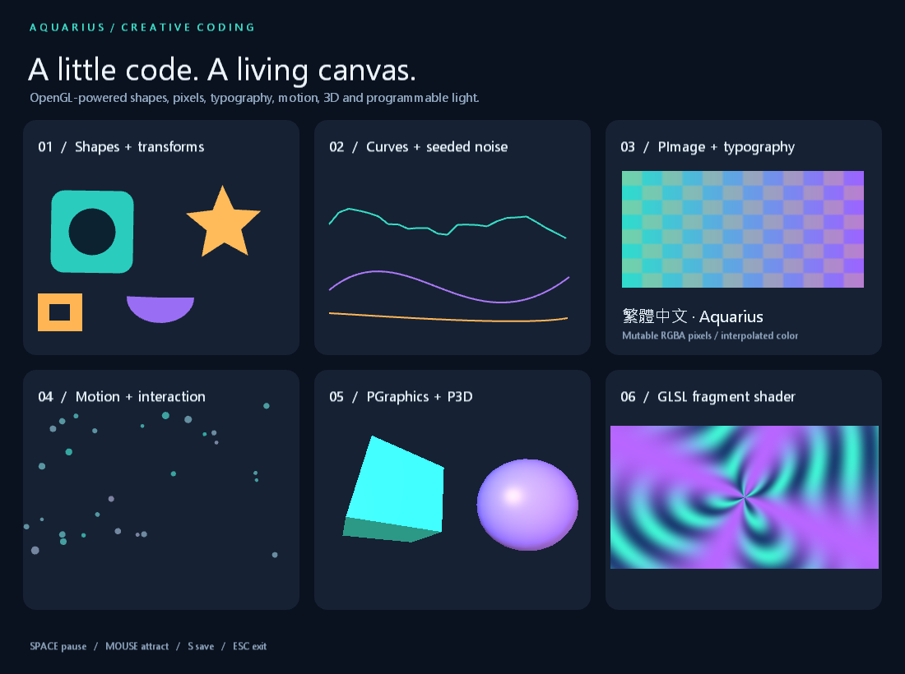

# Aquarius Processing showcase

Six animated panels demonstrate shapes and transforms, curves and seeded noise,
mutable RGBA images and Unicode text, interactive particles and PVector math,
offscreen P3D lighting, and a custom WGSL fragment shader.



```powershell
./native/build.ps1
dotnet run --project AquariusDesktopVMREPL -- AquariusDesktopVMREPL/examples/processing_showcase/main.aqua
```

**Space** pauses animation. Hold a **mouse button** to attract particles.
**S** saves `showcase-####.png` beside the script. **Esc** exits.
Resize the window freely; the 1100×820 composition scales to fit and centers in
the window. Mouse coordinates follow that layout, text is rasterized at display
resolution, and the offscreen 3D panel updates its backing texture size.

See the [Processing API guide](../../graphics/Processing.md) for functions,
callbacks, headless/GPU tests, finite capture options and compatibility differences.
