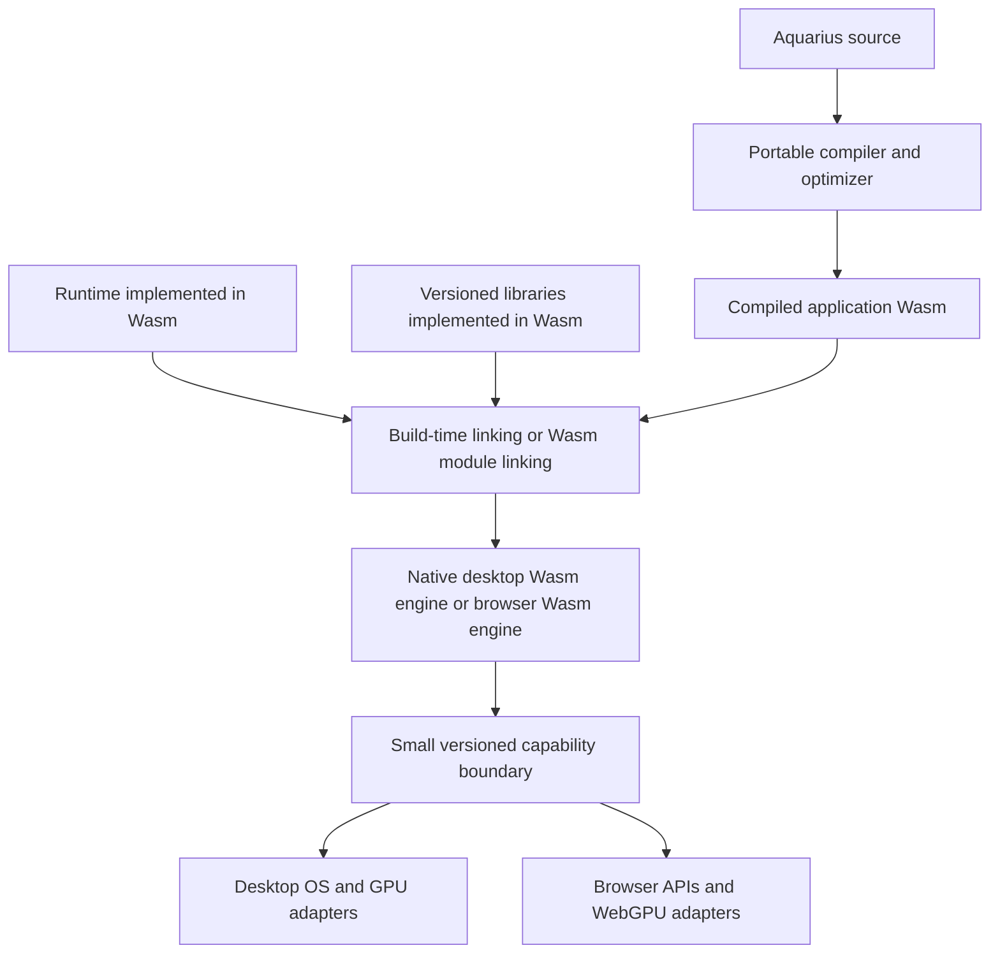

# Remaining work for a complete Wasm architecture

Audit date: 2026-10-10, Asia/Taipei. Source revision:
`b248015bb39b3c69c74e39c4f36b80e001f2b156`.

This checklist supplements [WASM_FINDINGS.md](C:/OfficialProjects/AquariusLang_PerformanceBenchmark/diagnostics/WASM_FINDINGS.md).
Its benchmark results are supplied evidence; this audit did not rerun those
measurements. The reported warm slowdown is about 2.08 times on that Windows
suite. The additional findings below come from the current repository. Proposed
designs and validation requirements are identified separately from existing defects.

The requested destination is a Wasm implementation of Aquarius execution and
portable libraries, with platform services behind a small host boundary. C# is
retained only for a specifically justified native integration that still needs it.
**Every future included library must implement its computation in Wasm.** A Wasm
file that calls back into C# or JavaScript for its algorithms does not satisfy this
requirement. Existing Emscripten, managed and JavaScript implementations need their
own migration; their presence is not permission to add more of them.

Removing C# dependencies is an architectural objective. Large performance gains
depend on removing object allocation, name lookup, scheduler work, repeated copies
and host crossings from hot paths. A rewrite in another host language that keeps
the same work and ABI does not establish a speedup. The amount of improvement must
be measured; the existing diagnostics do not predict a multiplier for a future design.

## Destination and architectural decisions

| Area | Current implementation | Required destination |
| --- | --- | --- |
| Execution | Wasm control flow; C#/JS implement most language operations | Numeric fast paths, dynamic fallback, values, scopes and script scheduling inside Wasm |
| Platform services | C# interfaces, delegates and JS objects | Versioned, language-neutral imports for actual OS/browser/GPU services |
| Libraries | C# adapters, Emscripten/V8, JS algorithms and some Wasm | Wasm algorithms and Wasm bindings; host adapters only for platform access |
| Deployment | .NET desktop runtime packs and browser host scripts | Portable Wasm plus a small platform launcher; documented residual native integrations |
| Compiler/tooling | C# lexer, parser, compiler, CLI, packaging and LSP | Independently portable toolchain without a mandatory C#/.NET dependency at final completion |

Wasm needs an embedder for I/O, OS resources and GPU/browser APIs. That need does
not make C# mandatory: the current native bridge already contains C, and Wasmtime
has native embedding APIs. Keep a native-service exception register containing
the API, required platform, reason C# is still needed, and replacement path. Merely
being implemented in C# today is insufficient justification. This boundary follows
the [WebAssembly embedding model](https://webassembly.github.io/spec/core/intro/introduction.html).

Recommended initial choices, subject to implementation prototypes:

| Decision | Recommended starting point | Reason and constraint |
| --- | --- | --- |
| Value storage | Unboxed numeric locals plus a tagged layout in linear memory for dynamic values | Makes ordinary core-Wasm libraries practical; requires allocator and tracing design. Wasm GC is an alternative requiring an explicit engine/interop compatibility decision. |
| Runtime inclusion | Link portable runtime helpers into the application for the first implementation | Gives direct Wasm calls and an optimizer-visible implementation. A separate runtime module is possible but needs a compatible memory/call ABI. |
| Library linking | Static linking for tightly coupled hot libraries; explicit module linking for optional libraries | Avoid one managed/JS wrapper per operation. A final linked `.wasm` is different from a relocatable object; the compiler needs a real linker strategy. |
| Public contracts | Machine-readable ABI schema; evaluate WIT for resources and public interfaces | Stop using CLR `Type` identity as the portable contract. Component Model packaging is a separate capability to implement and test. |
| Suspension | Keep synchronous work in Wasm; spill/resume at actual async boundaries and bounded yield points | Retains browser responsiveness and deep-recursion behavior without leaving Wasm on every call. |
| Platform engine | One Wasm engine per desktop application session where practical | Removes the current Aquarius-Wasmtime/Jolt-V8 split once Jolt is rebuilt for the supported ABI. |

WIT defines types and interfaces, including resource handles; it does not implement
library behavior. Core modules and components are different formats. Browser support
must be proven for the chosen deployment, including any generated binding layer;
writing WIT does not make the existing `WebAssembly.Instance` loader a component
loader. See the [WIT reference](https://component-model.bytecodealliance.org/design/wit.html)
and [JavaScript component tooling](https://component-model.bytecodealliance.org/language-support/building-a-simple-component/javascript.html).

## Complete migration checklist

Labels: **Confirmed** means visible in the source or supplied measurements;
**Design required** means a contract that the replacement needs;
**Validation required** means completion cannot be established by today's evidence.
**P0** establishes correctness, measurement or ABI foundations; **P1** is required
implementation for the intended architecture; **P2** follows the core migration
but remains required for final completion. References such as S1 point to the
source map at the end.

### Language and ABI foundations

1. **P0 · Confirmed — Numeric behavior is inherited from host conversions.**
   `ValueOperations` computes through `double` and then converts to integer/float;
   JS has its own integer conversion and `Math.fround` rules (S4, S6). Specify
   integer width, overflow, division by zero, minimum-integer division, negative
   division, NaN/infinity, signed zero, float rounding and mixed-type promotion.
   Native `i32` arithmetic/division cannot be substituted blindly. Preserve current
   supported behavior, or introduce an explicit language-version change for an
   intentional correction. Completion requires matching edge cases on every host.

2. **P0 · Design required — There is no Wasm-owned dynamic value layout.**
   Define tags, payloads, alignment, pointer width, object headers, reference
   identity, null versus no-result, callable representation, heap objects and
   native-resource handles. Use native numeric locals when proven safe; keep
   general values in the agreed Wasm layout. Specify NaN handling if considering
   NaN boxing. The slow path must also execute in Wasm. A host `externref` object
   for every scalar would retain the main architectural dependency.

3. **P0 · Confirmed — The host ABI exposes internal execution operations.**
   `aquarius_v1` imports `pop`, `duplicate`, `load`, arithmetic, loop/environment
   operations and `call` (S2). Replace this boundary with actual capabilities:
   console/output, files, timers, window/input, GPU and application services.
   Runtime helpers are Wasm functions, whether linked or imported from a Wasm
   runtime module. Publish signatures and ownership rules independently of C#.
   If adopting WASI, pin its interface/profile versions and explicitly adapt the
   needed services in browsers; WASI is not supplied by browser core-Wasm loading.

4. **P0 · Confirmed — Versions and feature requirements are too coarse.**
   One integer ABI version also determines the package format; constants and
   libraries have different evolution needs (S2, S13, S14). Separate language
   semantics, runtime/value ABI, capability contracts, library contracts, package
   schema and compiler provenance. Declare required Wasm features and supported
   engine versions. Reject incompatible combinations before program initialization;
   this migration needs an ABI break rather than treating v1 as already complete.

### Compiler and hot execution paths

5. **P1 · Confirmed — Numeric loops still call the host for each operation.**
   The emitter declares no additional locals and emits host imports for value
   operations (S1). Emit typed constants, locals, arithmetic and comparisons.
   Add guarded paths when types are uncertain, with a Wasm dynamic fallback.
   Completion: representative numeric kernels contain real arithmetic/local
   instructions and no per-operation managed/JS callbacks.

6. **P1 · Confirmed — The IR lacks the information required for these optimizations.**
   Existing lowering records stack operations, names and generic calls (S3).
   Add binding identities, types or type facts, control/data flow, liveness,
   capture/escape information, effects and suspension information. Implement
   constant folding, propagation, dead-code removal and selective inlining only
   where evaluation/error/side-effect order permits them. An optimizer downstream
   of opaque host imports cannot recover these facts reliably.

7. **P1 · Confirmed — Local and global access performs string dictionary lookup.**
   Lowering emits names and the runtime searches lexical environments and builtin
   registries (S3, S5). Resolve ordinary bindings to indexed slots at compilation;
   use stable module-global slots and captured cells where appropriate. Preserve
   builtin shadowing, declaration timing, redeclarations and unknown-name errors.
   REPL and genuinely dynamic module access need an explicit lookup path rather
   than forcing every local through a dictionary.

8. **P1 · Confirmed — Closures retain entire host environments.**
   C# `FunctionObj` and JS closure objects capture dictionaries/scopes; loop
   iterations create fresh scopes (S5, S6). Perform capture analysis and place
   escaping bindings in Wasm cells; keep uncaptured locals in locals/frame slots.
   Preserve assignment to the owning scope, bilingual callable identity, aliases
   after reassignment, and distinct captured loop iterations. Pool only scopes
   proven not to escape.

9. **P1 · Confirmed — All language calls return to a host scheduler.**
   `IrOperation.Call` ends a continuation, creates a host child frame and reenters
   an export (S1, S5). Resolve safe targets to direct Wasm calls; represent dynamic
   closures with a code/table index and environment pointer. Implement general
   dispatch inside Wasm. Guard mutable bindings and imported members; a function
   name alone does not prove the call target is permanent.

10. **P1 · Design required — Fast calls and suspension need compatible conventions.**
    Define a synchronous Wasm calling convention and resumable frames for functions
    that may await, yield or reach async host services. Propagate suspension effects
    across higher-order/dynamic calls conservatively; spill live values exactly
    where required. Restore values and error state after resume. Preserve eager
    argument evaluation and eager Boolean operators. Do not make every ordinary
    builtin call a mandatory suspension boundary.

11. **P1 · Design required — Direct recursion must retain existing depth safety.**
    Current explicit frames avoid host-stack growth, and deep recursion is tested
    (S5, S20). Use a Wasm-resident trampoline/explicit frame stack for unbounded
    recursion, or a checked fast-call depth with a safe resumable path. Tail calls
    can help selected cases but are not a replacement for general recursive calls.
    Define overflow/OOM behavior. Test mutual recursion, non-tail recursion and
    recursion across library/callback boundaries without an engine stack trap.

12. **P1 · Confirmed — Every basic block imports a checkpoint.**
    Budget accounting belongs in Wasm; poll/yield only at an amortized boundary
    (S1, S5, S6). Cover straight-line calls as well as loops, and define maximum
    cancellation latency. Desktop engine interruption and browser cooperative
    suspension need different adapters. Wasmtime fuel/epochs can assist desktop
    interruption, but do not automatically provide resumable browser execution;
    measure their overhead. See [Wasmtime interruption](https://docs.wasmtime.dev/examples-interrupting-wasm.html).

13. **P1 · Confirmed — The general language runtime remains outside Wasm.**
    Port truthiness, equality, string operations, dynamic arithmetic, array/hash
    construction/indexing/writes, member access, closure construction and loop
    bookkeeping (S4-S6). Preserve null/empty return behavior, implicit results,
    strict Boolean loop conditions, out-of-range reads and invalid writes. Merely
    specializing numbers while leaving the rest in C#/JS is an intermediate step,
    not completion of the requested architecture.

### Memory, data structures and language semantics

14. **P1 · Design required — Moving objects into Wasm requires memory management.**
    Choose allocation, reclamation, growth, fragmentation and OOM behavior before
    migrating collections. A linear-memory heap needs an allocator and tracing or
    another cycle-safe lifetime design; basic reference counting alone leaks cyclic
    arrays/closures. If choosing Wasm GC, establish library-buffer interoperability
    and the supported feature matrix. Native Wasm stack memory is not an automatic
    replacement for garbage collection.

15. **P1 · Confirmed — Resource tracing depends on host-language object graphs.**
    Current reachability walks environments, operands, loop scopes, callbacks and
    suspended native arguments (S5, S6). Replace those roots with Wasm stack maps,
    frame/heap tracing and resource tables. Trace captured library callback state
    too. Host registries must not permanently root every resource. Preserve
    extracted-method ownership, independent runs, reentry, disposal order and
    cleanup after failure/cancellation.

16. **P1 · Confirmed — Arguments and frames allocate host objects on every call.**
    `Arguments` always creates an array and `Call` always uses `builtin.Fn`, even
    though borrowed invocation exists (S5, S7). During transition, restore borrowed
    invocation where safe; the final design uses Wasm frame/argument windows and
    native scalar/buffer signatures. Reuse execution-owned storage with liveness
    checks. Borrowed arguments must survive reentry, aliasing and async suspension
    through pinning or owned copies; reuse must not overwrite a suspended caller.

17. **P1 · Confirmed — Public host values are mutable and can escape.**
    Numeric wrappers expose writable `Value`; arrays/environments/functions can be
    retained by host code (S7). Audit existing host APIs before unboxing or interning.
    Define materialization, mutation visibility and identity at the native boundary.
    An intermediate adapter may require invalidate/reload behavior around calls.
    Immutable value semantics are an intentional API change, not a safe assumption
    about existing `IObject` consumers.

18. **P1 · Confirmed — Array append copies the complete array.**
    Both `Utils.PushToArray` and browser `push` return a new copied array (S8, S16).
    Preserve the existing functional append contract; adding spare capacity alone
    cannot safely turn it into in-place mutation. Introduce explicit reserve,
    pre-sized construction or mutable builders, or a semantics-preserving persistent
    representation. Benchmark old and new APIs separately using equivalent
    algorithms. Slices/rest and bulk fill also need an allocation/copy strategy.

19. **P1 · Confirmed — Binary data becomes one language object per byte/number.**
    `ApplicationValues.Binary` creates `IntegerObj` arrays; browser wrap/unwrap
    recursively copies arrays (S6, S18). Add byte buffers and typed numeric buffers
    with Wasm-resident storage, bulk views and explicit conversion APIs. Specify
    length, alignment, endianness, read/write rights and transfer/borrow lifetime.
    Keep ordinary heterogeneous arrays compatible. Invalidate/reacquire browser
    memory views after growth; never treat a guest offset as a native address.

20. **P1 · Confirmed — Hash identity depends on host hash-code behavior.**
    C# string/float/double keys reduce the full key to a type plus a 32-bit hash
    code, while JS uses textual keys (S4, S6, S7). Equal hash codes can therefore
    alias distinct C# keys. Define full-key equality and collision resolution in
    the Wasm runtime, including typed numeric keys, NaN and signed zero. Preserve
    deliberate language rules; treat correction of accidental collision behavior
    explicitly. Test collisions and parity instead of porting CLR hash identities.

21. **P1 · Confirmed — Text and formatting still inherit C#/browser behavior.**
    String length uses UTF-16 units, editing uses grapheme/scalar conversions, and
    formatting/segmentation use host facilities (S7, S16, S18). Define internal text
    encoding, public indexing units, malformed text policy, Unicode data version,
    numeric parsing/formatting and locale rules. A UTF-8 Wasm layout must still
    preserve public UTF-16 and grapheme APIs. Move portable processing into Wasm;
    OS font discovery and input remain capabilities.

22. **P1 · Confirmed — Errors rely on managed exceptions and JS throws.**
    Language errors, engine traps and host failures currently travel through
    different mechanisms (S5, S6, S9). Define Wasm error/result representation,
    panic/trap classification, cleanup/unwinding, source locations and async error
    propagation. Preserve fail-before-later-side-effects behavior and Processing
    error-event handling. A bounds failure or missing resource must not be silently
    converted to a success value by a new library binding.

### Host execution, events and startup

23. **P1 · Confirmed — Desktop and browser duplicate the language runtime.**
    `WasmRuntime.cs` and `wasm.mjs` independently implement scopes, arithmetic,
    collections and scheduling (S5, S6). Ship the same portable runtime Wasm on
    both; adapters supply only capabilities and byte/handle transport. During
    migration, version any host fallback and test it against the Wasm implementation.
    Remove duplicated language semantics after parity is established.

24. **P1 · Confirmed — Desktop async APIs are synchronously blocked.**
    Core application binding uses `GetAwaiter().GetResult()` while browser calls
    await Promises (S18). Define pending-operation handles, completion delivery,
    cancellation, host-thread affinity and resume behavior. Keep synchronous calls
    fast, and keep long I/O/GPU/codec operations off the UI thread. Define what
    happens to borrowed buffers and resources if cancellation races completion.

25. **P1 · Confirmed — Callback reentry creates new execution machinery.**
    `Invoke` creates a new execution; reachability includes nested executions
    (S5, S16, S20). Add session-owned callback handles and Wasm-resident invocation
    frames. Specify nested calls, event ordering, same-instance reentry versus
    queued execution, exceptions and disposal. Pooling one instance requires proof
    it is not already borrowed by an active callback or suspended task. Preserve
    GLFW/GPU thread restrictions.

26. **P1 · Confirmed — Stores/instances/import maps are created per execution.**
    C# creates a Store/Linker and browser `execute` constructs a new instance map
    (S5, S6, S9). Separate immutable compiled modules from mutable session state;
    reuse prepared linking/instances where supported and safe. Introduce reset,
    teardown and pool ownership contracts. Preserve independent program globals,
    repeated-script-import semantics, REPL persistence and captured callbacks.

27. **P1 · Confirmed — Compiled module caching is based on byte-array identity.**
    The desktop cache misses equivalent newly loaded bytes and does not persist
    across process launches (S9). Cache by content plus engine version,
    configuration/features and target CPU/OS; evaluate persistent engine compilation
    caching and platform-specific precompilation. Keep portable `.wasm` authoritative.
    Precompiled machine code needs a trusted production/cache path and compatibility
    validation; do not deserialize arbitrary native-code caches as if they were
    sandboxed Wasm. See [compilation caching](https://docs.wasmtime.dev/examples-fast-compilation.html)
    and [precompilation](https://docs.wasmtime.dev/examples-pre-compiling-wasm.html).

28. **P1 · Confirmed — Startup registers unrelated functionality eagerly.**
    `GraphicsRuntime` registers GL, GLFW, text, math, images, Processing, WGPU and
    application APIs even for small CLI programs (S16). Prepare capabilities lazily
    and instantiate libraries only when needed, with lightweight builtin tables.
    Separate frontend compilation, engine compilation, linking, initialization,
    first execution and repeated execution in startup measurements. Laziness must
    retain explicit errors for unavailable capabilities.

### Existing libraries and future inclusion

29. **P0 · Confirmed — Existing extension rules allow non-Wasm implementations.**
    The descriptor and documentation accept HostCapability, CoreWasm and
    Emscripten profiles (S10, S23). For every future library, require the entire
    portable algorithm and its language binding to execute in Wasm. Forbid new
    C# algorithm providers, JS algorithm libraries, native `.dll`/`.so` algorithm
    plugins and subprocess-backed substitutes. Separate host-service adapters from
    included computational libraries. Audit transitive dependencies as well.

30. **P1 · Confirmed — Library contracts are CLR interfaces rather than Wasm ABIs.**
    `ExternalLibraryDescriptor.Contract` stores `Type`; registration uses `typeof(T)`
    and `Func<object>` (S10). Replace these as the portable authority with an ABI
    schema describing exact imports/exports, argument/result types, errors,
    resource lifetimes and capabilities. Generate Aquarius aliases, bindings, docs
    and editor metadata from it. A C# interface can remain an adapter detail during
    migration but must not be necessary to implement or load a library.

31. **P1 · Confirmed — There is no application library dependency manifest.**
    The current catalog is a static `All` list; application metadata has no resolved
    library graph (S10, S13). Add package identity, exact version/content digest,
    runtime/value ABI, dependency locks, interface schema, feature requirements,
    declared capabilities, lifecycle hooks and licenses. Resolve transitive
    dependencies deterministically; reject incompatible duplicates, dependency
    cycles requiring undefined initialization and export/import conflicts.

32. **P1 · Confirmed — The engine abstraction cannot link ordinary Wasm libraries.**
    `IWasmEngine` accepts only delegate imports and returns continuation exports;
    the desktop adapter supports just three host delegate signatures (S2, S9).
    Implement Wasm function/memory/table/global linking, typed library calls and
    dependency instances. The browser must wire module exports as imports too.
    Keep calls Wasm-to-Wasm rather than routing them through managed/JS delegates.
    [Wasmtime module linking](https://docs.wasmtime.dev/examples-linking.html) provides
    an embedding example, not an implementation in the current adapter.

33. **P1 · Design required — Library memory and callable ownership are undefined.**
    Choose shared application memory for trusted tightly coupled modules, isolated
    memory with explicit transfer for independent modules, or component lifting/
    lowering. Shared memory means shared allocation authority and weaker isolation;
    isolated memories require copies or handles. A pointer in one module is not a
    valid pointer in another automatically. Define alloc/free/realloc, post-return
    cleanup, buffer borrowing, callback table registration, retention and shutdown.

34. **P1 · Confirmed — Packaging skips `.wasm` files supplied as assets.**
    `WasmApplication.Compile` explicitly excludes them, and automatic web source
    builds use an asset-extension whitelist without library Wasm (S14, S15).
    Add a library channel separate from ordinary assets; validate, resolve, bundle
    and link those modules for desktop, web and executable export. Preserve existing
    traversal/collision/size protections. Copying a library file into a directory
    must not falsely imply it will appear in the finished application.

35. **P1 · Confirmed — Imports resolve builtins or packaged `.aqua` identities.**
    Packaged script imports require `.aqua` paths; unpackaged desktop imports can
    read source and compile on demand (S17). Define Wasm-library import identities,
    build-time resolution and any permitted late-loading API. Cache code separately
    from instance/global state; existing repeated script imports create independent
    globals. Literal imports can support dependency pruning, while dynamic names
    need an explicit declared dependency set. Never silently fall back to source
    parsing, a host-language library or an external process.

36. **P1 · Confirmed — Jolt is Wasm but its integration still requires JS/V8.**
    Each desktop physics world creates a V8 engine, executes Emscripten glue/shared
    JS and crosses C#/V8 with arrays and method calls (S11). Build a standalone
    Jolt Wasm module with a supported native Wasm facade; move shared world logic
    and wrappers into Wasm, batch body/state operations, and run it through the
    application engine. Audit actual Jolt imports first; removing glue files alone
    cannot work. Emscripten's standalone setting still requires compatible imports,
    and may retain JS-only APIs. See [standalone Wasm settings](https://emscripten.org/docs/tools_reference/settings_reference.html#standalone-wasm).
    Retain existing capacities, ownership checks and numerical tolerance tests.

37. **P1 · Confirmed — Images use different implementations on each platform.**
    Desktop uses Magick.NET/native ImageMagick; browser uses magick-wasm plus worker
    glue, while other paths use native/browser codecs (S12, S18, S23). Choose one
    supported portable codec Wasm implementation and Wasm wrappers for the shared
    feature set. Keep file/clipboard/display transport in host adapters. Preserve
    frame selection, metadata/orientation, alpha, limits, timeout/cancellation and
    encoder options. Existing wasm-bearing packages must pass the same import/glue
    audit as Jolt before the native/managed dependency can be removed.

38. **P1 · Confirmed — Drawing and math contain substantial C#/JS computation.**
    Processing geometry, triangulation, transforms and vectors run in host code;
    browser dependencies include `earcut` and `gl-matrix` (S12, S16). Move these
    algorithms and portable sketch/state logic into Wasm. Retain shader source and
    GPU ABI contracts; GPU shader execution remains on the GPU. Leave surface
    creation, command submission, mapping and presentation in small adapters.
    Audit `legacy.mjs` as API compatibility code, not proof of a remaining VM.

39. **P1 · Confirmed — Application utility computation remains in C#/JS.**
    Text editing, path normalization, serialization, compression/archive handling,
    image encoding and preferences/document transformations use portable C# plus
    JS, including `fflate` (S18, S23). Migrate portable algorithms to Wasm libraries.
    Keep provider I/O, persistence transactions, dialogs and OS access as capabilities.
    Preserve documented encodings, checksums, archive limits, atomic-save results
    and editing behavior. Optional future libraries such as databases or scientific
    packages follow this same split.

40. **P1 · Confirmed — Library lifecycle is bound to host factories and globals.**
    Registry instances are CLR objects disposed in reverse creation order; physics
    worlds and callbacks retain host state (S10, S11). Define per-session versus
    per-import instances, initialization dependencies, start-function side effects,
    failure rollback and finalization. Reuse immutable library code, with explicit
    mutable state ownership. Prevent disposal while operations/callbacks are live
    and clean up partial initialization on every platform.

41. **P1 · Design required — Wasm libraries need capability and resource limits.**
    Admit only declared imports and provide only requested capabilities. Define
    memory/table limits, recursion/work budgets, cancellation and validation for
    library calls too; checkpoints in Aquarius code cannot stop an infinite loop
    inside an opaque library. Browser workers can provide termination for suitable
    compute tasks. Define whether a library shares application trust/memory or is
    isolated; the `.wasm` extension alone does not settle that contract.

42. **P1 · Confirmed — Library/native bindings copy and box large payloads.**
    Browser `unwrap`/`wrap`, graphics array conversion and Jolt vectors perform
    repeated conversions (S6, S11, S16, S18). Add bulk state queries, typed buffers,
    geometry uploads and batched commands. Validate pointer/length arithmetic at
    actual native boundaries. Zero-copy is permitted only with the agreed lifetime,
    alignment and memory rules; an ABI using JSON for each operation would recreate
    a serialization bottleneck.

### C# removal, artifacts and cross-platform deployment

43. **P1 · Confirmed — The desktop launcher still depends on .NET.**
    `AquariusAppHost` references Desktop and publishes a self-contained .NET bundle
    (S12, S19). After moving execution into Wasm, use a small native launcher/engine
    integration and capability providers. Remove managed core/runtime/library
    assemblies from normal execution. Evaluate each remaining C# native adapter
    against the exception register. Self-contained publishing and NativeAOT may
    change distribution/startup, but do not themselves remove C# architectural
    ownership of language execution.

44. **P2 · Confirmed — Build tools and editor tooling are also C# dependencies.**
    The frontend, CLI, packager/exporter and language server are C# (S3, S12, S19).
    Application execution can be migrated first, but total dependency removal
    also requires a portable compiler, linker/packager, CLI and LSP implementation.
    A native compiler or compiler compiled to Wasm are viable directions; avoid
    shipping a .NET runtime inside Wasm as a substitute for this objective. Track
    development/toolchain dependencies separately from deployed application ones.

45. **P1 · Confirmed — Standalone runtime packs assume the existing managed stack.**
    Publication requires Wasmtime, ClearScript/V8, Magick.NET/native codecs, .NET
    runtime files and the graphics bridge; runtime manifests and overlay loaders
    assume the current composition (S19). Rebuild packs around the replacement
    launcher, portable runtime/libs and necessary native services. Version overlay
    and pack contracts, update smoke checks/licenses, and test clean-machine startup,
    extraction/cache behavior and relocation without installed SDKs or runtimes.

46. **P1 · Confirmed — Native graphics interfaces expose host-specific machinery.**
    OpenGL bindings marshal `IObject` arrays and use `DynamicInvoke`; window/buffer
    ownership is represented by C# objects and pointers (S16). Retain compatibility
    through checked typed imports and opaque resource IDs. Keep existing native
    bridge/GPU work where required, while moving validation-independent portable
    math/geometry into Wasm. Separate the legacy graphics API from the main WebGPU
    boundary; both need correct disposal and foreign-handle rejection.

47. **P1 · Confirmed — A portable Wasm file does not make every capability portable.**
    Default CLI export targets are web and Windows x64; runtime-pack publishing is
    Windows-only. Desktop dialogs, printing, accessibility and font enumeration
    have Windows restrictions (S19, S21). Define the supported Windows/Linux/macOS
    and CPU matrix, add launcher/native packs, and implement or explicitly report
    unavailable services on each. Preserve virtual package path semantics separately
    from case-sensitive host filesystem/provider identities. C# removal alone does
    not implement missing OS features.

48. **P1 · Design required — Optional Wasm features need portable profiles.**
    Establish a baseline covering the tested browsers and desktop engines. Gate
    SIMD, threads/atomics, shared memory, memory64, GC, exception handling, tail
    calls and stack switching on real support. Add optional optimized Wasm variants
    only when worthwhile. Threaded browser profiles require their hosting/worker
    conditions; use a supported single-threaded Wasm implementation otherwise.
    Reject unsupported mandatory features, rather than selecting a C#/JS library
    implementation silently.

49. **P1 · Confirmed — CI coverage does not establish the whole platform contract.**
    Jolt has Windows/Linux/macOS tests, while principal desktop/web workflows use
    Windows (S22). Expand tests to the full runtime/toolchain and relevant native
    capabilities on supported OS/CPU targets; include supported Chromium, Firefox
    and WebKit/browser versions where applicable. Test the same application and
    library bytes across engines. Record capability/feature skips so a passing
    suite is not mistaken for a validated unavailable feature.

50. **P1 · Confirmed — Runtime constants and function state depend on JSON metadata.**
    The custom section holds constants, parameters/function maps and base64 assets;
    host imports materialize values from it (S1, S13). Move executable constants,
    runtime layouts and closure data into Wasm data/code as appropriate. Retain a
    compact versioned manifest for linking/entry/assets rather than treating JSON
    as the execution model. Function `Display` currently retains rendered bodies:
    make inspection/debug/source-retention policy explicit instead of promising
    that no source-derived text is ever present.

51. **P1 · Confirmed — Assets and unused libraries increase export/load work.**
    Web export writes assets into `program.json` although they are already in the
    Wasm custom section, and exports all catalogued external libraries plus all
    browser resources (S13-S15). Use one authoritative asset store, compact binary
    payloads or hashed sidecars, dependency pruning and lazy library fetch/load.
    Preserve relocatability, offline/self-contained options and atomic export.
    Measure download, parse/decode, peak memory and first-use costs independently.

52. **P1 · Confirmed — Host metadata validation is not implemented equally.**
    C# checks counts, references, paths and asset encodings; browser `ready` mainly
    checks section count and ABI before consuming metadata (S6, S13). Align
    validation for library graphs, imports/exports, entry signatures, feature
    declarations, bounds and digests. Wasm engine validation covers code/types,
    not Aquarius manifests or native pointer access. Preserve the protections
    already present; hashes provide integrity only relative to a trusted manifest.

### Measurement, compatibility and completion

53. **P0 · Confirmed — The published benchmark still selects the legacy runtime.**
    Update executable discovery and command construction in the benchmark repo;
    identify source-build versus prebuilt-Wasm run modes and fingerprint actual
    core/engine/launcher/library binaries. Preserve the old results as historical
    data. Report cold process startup, warm module/session execution, allocations,
    peak memory and engine compilation separately. The supplied diagnostics already
    demonstrate why the current published score cannot validate this migration.

54. **P1 · Validation required — Current workloads do not cover the complete goal.**
    Keep the ten existing validated workloads and add numeric loops, polymorphic
    operations, captured closures, array construction, typed buffers, hashes/text,
    module/library linking, callback reentry, async I/O, Processing and Jolt/codec
    bulk operations. Include cold and repeated runs on the supported platforms.
    Compare equivalent APIs/algorithms and report any deliberate workload changes.

55. **P1 · Validation required — Causes need CPU/allocation and ABI evidence.**
    Profile guest execution, host crossings, allocation/reclamation, scheduler,
    library conversion and startup with separate instrumented runs. Decode emitted
    Wasm and classify calls as guest-to-guest versus guest-to-host; an import can
    legitimately resolve to another Wasm module. Report per-kernel crossing and
    allocation counts. Call-count percentages in the supplied report are not CPU
    time percentages, and managed allocation totals are not resident-memory peaks.

56. **P0/P1 · Validation required — Semantic tests must survive optimization.**
    Reuse existing language, deep-recursion, callback/resource-lifetime, packaging
    and cross-engine tests (S20). Add differential tests for numeric edge cases,
    error/evaluation order, captured iteration scopes, hashes, ABI ownership,
    borrowed/pinned buffers, cancellation races and mixed old/new call paths.
    Borrowed-call tests must check which entry point is used and allocation behavior;
    functional equality alone will not catch the existing allocation regression.

57. **P1 · Validation required — Completion needs performance and dependency gates.**
    Establish representative baselines and explicit per-workload tolerances,
    allocation/crossing limits and cancellation-latency bounds. Use sufficient
    randomized samples and report distributions on stable runners. Require a
    meaningful warm CPU improvement plus no unexplained compatibility/startup
    regressions; define a numerical speed target only after the first working
    prototype. Fail architecture checks if portable execution returns to managed
    object operations or included libraries use forbidden implementation backends.

58. **P2 · Confirmed — Documentation describes the partial migration as the design.**
    Architecture/extension guidance assigns values and scheduling to hosts and
    permits future Emscripten adapters; language docs also contain stale opcode/
    artifact references and exploratory host bindings (S23). Update these as the
    replacement lands, along with embedding APIs, CLI names, build instructions,
    LSP signatures and library guides. Clearly label transitional behavior; saying
    that control flow is compiled is accurate but insufficient for the requested
    Wasm-owned runtime.

59. **P1 · Validation required — Future libraries need reproducible Wasm builds.**
    Add pinned source/toolchain/build flags, artifact and interface hashes,
    licenses/provenance, dependency locks and a reproducible packaging pipeline.
    Test a small representative library from source to desktop/browser use without
    adding platform-specific algorithm code. Verify allowed imports, feature
    profiles, ownership, failure paths and output parity in CI. The current npm
    vendor-copy script is not a generic standalone-Wasm build/link pipeline (S12).

60. **P2 · Design required — Retiring legacy routes needs an explicit release plan.**
    Support v1 only as a separately identified transitional host or require source
    recompilation for v2. Update build/benchmark/editor discovery, remove obsolete
    runtime artifacts from new distributions, and reject retired package/ABI
    versions with actionable errors. Old VM-named directories and releases can
    still exist locally; they are not evidence that a VM is active in tracked
    production source. Remove fallback paths only after compatibility gates pass.

## Policy for every future included library

Admission requires all of the following:

- The library's portable algorithms, state management and Aquarius-facing binding
  execute in Wasm, including transitive computational dependencies. Source may be
  Rust, C/C++, Aquarius or another language producing the approved Wasm ABI without
  requiring a managed/JS algorithm runtime.
- The artifact is an approved core-Wasm module or supported Wasm component, with
  exact imports/exports and a versioned interface. A generic `.wasm` filename,
  Emscripten side-module label or standalone compiler flag is not enough.
- Minimal browser JS may instantiate modules, transport buffers/handles, await
  browser APIs and deliver events. It must not implement the library's algorithm
  or Aquarius value runtime. Desktop native adapters obey the same boundary.
- A computational library needing OS access uses declared capability imports.
  WebGPU/window/input/files are services supplied by the host; they are not a
  loophole for a native or managed implementation of the library's computation.
- A library without a compatible Wasm build must be ported/rebuilt or deferred.
  Do not include a native DLL, C# wrapper, Python subprocess or JS implementation
  as its replacement. Existing exceptions must be tracked through migration.
- Version/digest locks, interface/feature validation, ownership/error rules,
  resource limits, licenses and desktop/browser conformance tests are present
  before inclusion.

For Emscripten specifically, pure side modules still depend on a compatible main
module/system runtime; they are not generic plugins for the current Aquarius
loader. See [Emscripten dynamic linking](https://emscripten.org/docs/compiling/Dynamic-Linking.html).
Rebuilding a library against the selected ABI is preferable to growing another
host-language compatibility engine around each package.

The future manifest should carry at least these independent facts:

| Manifest field | Purpose |
| --- | --- |
| Package ID, exact version and content digest | Identity, locking and deduplication |
| Artifact kind and files | Core module/component and executable/data/license assets |
| Runtime/value ABI and interface schema/version | Compatible signatures, layouts and generated bindings |
| Export/import signatures and memory/table contract | Actual linking, including dependency-owned exports |
| Resolved dependency graph and digests | Reproducible transitive inclusion |
| Required Wasm features and supported profiles | Deterministic compatibility selection |
| Capability imports | OS/browser access admitted by the host |
| Ownership, callbacks, async and error rules | Correct interoperation and cleanup |
| Initialization/disposal and resource budgets | Instance lifecycle and bounded execution |
| Provenance, toolchain/build flags and licenses | Rebuildability and redistribution |

## Implementation order and proof of completion

| Stage | Work | Required exit evidence |
| --- | --- | --- |
| 1. Establish contracts and truth | 1-4, 29, 53, baseline portions of 54-57 | Semantic edge-case specification; v2 value/capability/library ABI prototype; correct backend fingerprints |
| 2. Build one vertical path | 5-17, 23 and 56 for a numeric/closure/call workload | Real locals/arithmetic; Wasm dynamic fallback; Wasm-owned calls/heap; no host value operations in the measured kernel |
| 3. Complete language execution | 7-28, including collections, errors, async and resources | Shared desktop/browser runtime; deep recursion, REPL/imports and cancellation/reentry compatibility; warm performance improvement |
| 4. Prove library inclusion | 30-42, 50-52, 59 | One library build/link/packaging path working with identical Wasm on both hosts; existing Jolt/codecs/utilities migrated through it |
| 5. Replace deployment and close portability gaps | 43, 45-49 | Clean-machine packs on declared OS/CPU targets; unnecessary managed/V8 dependencies removed; residual native exceptions documented |
| 6. Remove toolchain dependency and retire transition | 44, 58, 60; final 54-57 | Portable compiler/CLI/LSP and build pipeline; documented ABI cutover; release gates pass |

Stage 4's ABI/linking prototype belongs in Stage 1 so the runtime layout does not
need another redesign when libraries arrive. Startup/cache tuning can proceed
once ownership is stable; it cannot substitute for Stage 2's hot-path changes.

Final completion requires all of these outcomes:

- Pure Aquarius computation, including dynamic fallback, runs entirely within
  Wasm. No per-operation C#/JS arithmetic, operand-stack, environment or script-call
  service remains.
- Portable application libraries use the same supported Wasm implementation on
  desktop and browser; the future-library admission policy is enforced by tooling.
- OS/browser/GPU calls use a small capability ABI with bulk byte/handle transport,
  explicit ownership, async/cancellation behavior and truthful availability.
- Application execution and the final toolchain have no mandatory C#/.NET dependency
  beyond reviewed native integrations with recorded justification.
- Supported platform/browser artifacts pass semantic, library, lifecycle and
  clean-machine tests. Cross-platform means a declared tested capability matrix.
- Correctly identified benchmarks demonstrate the agreed performance improvement,
  with cold/warm time, crossings, allocation and memory reported separately.

## Source map

All references identify the audited revision above. These links are local to the
workspace; timings remain attributed to the separate supplied diagnostics.

| Ref | Evidence |
| --- | --- |
| S1 | [WasmCompiler.cs](C:/OfficialProjects/AquariusLangTW/AquariusCore/wasm/WasmCompiler.cs:47): function display, imports, locals, checkpoints and continuation calls |
| S2 | [WasmAbi.cs](C:/OfficialProjects/AquariusLangTW/AquariusCore/wasm/WasmAbi.cs:9): v1 execution imports and narrow engine interfaces |
| S3 | [LoweringCompiler.cs](C:/OfficialProjects/AquariusLangTW/AquariusCore/LoweringCompiler.cs:68), [LoweredProgram.cs](C:/OfficialProjects/AquariusLangTW/AquariusCore/LoweredProgram.cs:9): generic named stack IR |
| S4 | [ValueOperations.cs](C:/OfficialProjects/AquariusLangTW/AquariusCore/ValueOperations.cs:8): numeric conversion, truthiness, equality and collection access |
| S5 | [WasmRuntime.cs](C:/OfficialProjects/AquariusLangTW/AquariusCore/wasm/WasmRuntime.cs:19), [Environment.cs](C:/OfficialProjects/AquariusLangTW/AquariusCore/object/Environment.cs:8): host roots, frames, values, calls, scopes and scheduler |
| S6 | [wasm.mjs](C:/OfficialProjects/AquariusLangTW/AquariusWebCompiler/browser/wasm.mjs:4), [values.mjs](C:/OfficialProjects/AquariusLangTW/AquariusWebCompiler/browser/values.mjs:1): duplicated JS language operations, boxed values, wrapping and scopes |
| S7 | [Object.cs](C:/OfficialProjects/AquariusLangTW/AquariusCore/object/Object.cs:64): hash identity, mutable wrappers, arrays/closures and borrowed builtin entry |
| S8 | [Utils.cs](C:/OfficialProjects/AquariusLangTW/AquariusCore/utils/Utils.cs:6), [DesktopBuiltins.cs](C:/OfficialProjects/AquariusLangTW/AquariusDesktop/DesktopBuiltins.cs:104): functional copying append |
| S9 | [WasmtimeEngine.cs](C:/OfficialProjects/AquariusLangTW/AquariusDesktop/runtime/WasmtimeEngine.cs:12): default engine, byte-identity cache, per-execution Store/Linker and delegate signatures |
| S10 | [ExternalLibraries.cs](C:/OfficialProjects/AquariusLangTW/AquariusCore/external/ExternalLibraries.cs:10): profiles, CLR contracts, fixed catalog and instance factory registry |
| S11 | [WasmJoltBackend.cs](C:/OfficialProjects/AquariusLangTW/AquariusDesktop/physics/WasmJoltBackend.cs:39), [shared physics.mjs](C:/OfficialProjects/AquariusLangTW/AquariusCore/external/jolt/physics.mjs): V8-per-world execution, JS wrappers and marshaling |
| S12 | [AquariusCore.csproj](C:/OfficialProjects/AquariusLangTW/AquariusCore/AquariusCore.csproj), [AquariusDesktop.csproj](C:/OfficialProjects/AquariusLangTW/AquariusDesktop/AquariusDesktop.csproj), [package.json](C:/OfficialProjects/AquariusLangTW/AquariusWebCompiler/package.json), [prepare-vendor.mjs](C:/OfficialProjects/AquariusLangTW/AquariusWebCompiler/scripts/prepare-vendor.mjs): .NET/native and JS dependencies, pinned asset preparation |
| S13 | [WasmProgram.cs](C:/OfficialProjects/AquariusLangTW/AquariusCore/wasm/WasmProgram.cs:10): JSON constants/assets and metadata validation |
| S14 | [WasmApplication.cs](C:/OfficialProjects/AquariusLangTW/AquariusPackaging/WasmApplication.cs:46): omitted Wasm assets, source module compilation, package/path contracts |
| S15 | [WebsiteCompiler.cs](C:/OfficialProjects/AquariusLangTW/AquariusWebCompiler/WebsiteCompiler.cs:49): repeated assets, all-catalog exports and fixed browser resource staging |
| S16 | [GraphicsRuntime.cs](C:/OfficialProjects/AquariusLangTW/AquariusDesktop/graphics/GraphicsRuntime.cs:28), [host.mjs](C:/OfficialProjects/AquariusLangTW/AquariusWebCompiler/browser/host.mjs:1), [ProcessingGeometry.cs](C:/OfficialProjects/AquariusLangTW/AquariusDesktop/graphics/ProcessingGeometry.cs), [processing.mjs](C:/OfficialProjects/AquariusLangTW/AquariusWebCompiler/browser/processing.mjs:1): registration, transport, geometry and host library behavior |
| S17 | [WasmApplicationRuntime.cs](C:/OfficialProjects/AquariusLangTW/AquariusDesktop/runtime/WasmApplicationRuntime.cs:39), [DesktopBuiltins.cs](C:/OfficialProjects/AquariusLangTW/AquariusDesktop/DesktopBuiltins.cs:135): packaged/source imports and callback composition |
| S18 | [ApplicationRuntime.cs](C:/OfficialProjects/AquariusLangTW/AquariusCore/application/ApplicationRuntime.cs:41), [ApplicationValues.cs](C:/OfficialProjects/AquariusLangTW/AquariusCore/application/ApplicationValues.cs:21), [Serialization.cs](C:/OfficialProjects/AquariusLangTW/AquariusCore/application/Serialization.cs), [portable.mjs](C:/OfficialProjects/AquariusLangTW/AquariusCore/application/portable.mjs), [DesktopImages.cs](C:/OfficialProjects/AquariusLangTW/AquariusDesktop/application/DesktopImages.cs): blocking async bindings, boxed byte arrays and portable/native utility implementations |
| S19 | [AquariusAppHost.csproj](C:/OfficialProjects/AquariusLangTW/AquariusAppHost/AquariusAppHost.csproj), [CompilerBuildTargets.cs](C:/OfficialProjects/AquariusLangTW/AquariusCli/CompilerBuildTargets.cs:8), [publish-apphost.ps1](C:/OfficialProjects/AquariusLangTW/scripts/publish-apphost.ps1:10), [package-release.ps1](C:/OfficialProjects/AquariusLangTW/scripts/package-release.ps1:149): .NET application packs, target selection and publication |
| S20 | [CompilerAndMachineTest.cs](C:/OfficialProjects/AquariusLangTW/AquariusTests/compiler/CompilerAndMachineTest.cs:66), [CallConventionTest.cs](C:/OfficialProjects/AquariusLangTW/AquariusTests/compiler/CallConventionTest.cs:29), [ResourceLifetimeTest.cs](C:/OfficialProjects/AquariusLangTW/AquariusTests/compiler/ResourceLifetimeTest.cs), [WasmArtifactTest.cs](C:/OfficialProjects/AquariusLangTW/AquariusTests/compiler/WasmArtifactTest.cs), [PortableWasmTest.cs](C:/OfficialProjects/AquariusLangTW/AquariusTests/packaging/PortableWasmTest.cs): existing semantics, reentry, lifetime and portability coverage |
| S21 | [DesktopFonts.cs](C:/OfficialProjects/AquariusLangTW/AquariusDesktop/application/DesktopFonts.cs:9), [DesktopDialogs.cs](C:/OfficialProjects/AquariusLangTW/AquariusDesktop/application/DesktopDialogs.cs:8), [DesktopPrinting.cs](C:/OfficialProjects/AquariusLangTW/AquariusDesktop/application/DesktopPrinting.cs:8), [DesktopAccessibility.cs](C:/OfficialProjects/AquariusLangTW/AquariusDesktop/application/DesktopAccessibility.cs:14), [DesktopClipboard.cs](C:/OfficialProjects/AquariusLangTW/AquariusDesktop/application/DesktopClipboard.cs:9): current OS restrictions |
| S22 | [test-windows.yml](C:/OfficialProjects/AquariusLangTW/.github/workflows/test-windows.yml), [test-web.yml](C:/OfficialProjects/AquariusLangTW/.github/workflows/test-web.yml), [test-jolt.yml](C:/OfficialProjects/AquariusLangTW/.github/workflows/test-jolt.yml): current platform coverage |
| S23 | [ARCHITECTURE.md](C:/OfficialProjects/AquariusLangTW/ARCHITECTURE.md), [external-libraries.md](C:/OfficialProjects/AquariusLangTW/docs/external-libraries.md), [application-libraries.md](C:/OfficialProjects/AquariusLangTW/docs/application-libraries.md), [LANGUAGE.md](C:/OfficialProjects/AquariusLangTW/AquariusCore/LANGUAGE.md): current host-owned runtime and extension guidance |

This is an architecture audit and migration backlog. Creating this document does
not implement ABI v2, migrate a library or establish a new performance result.
