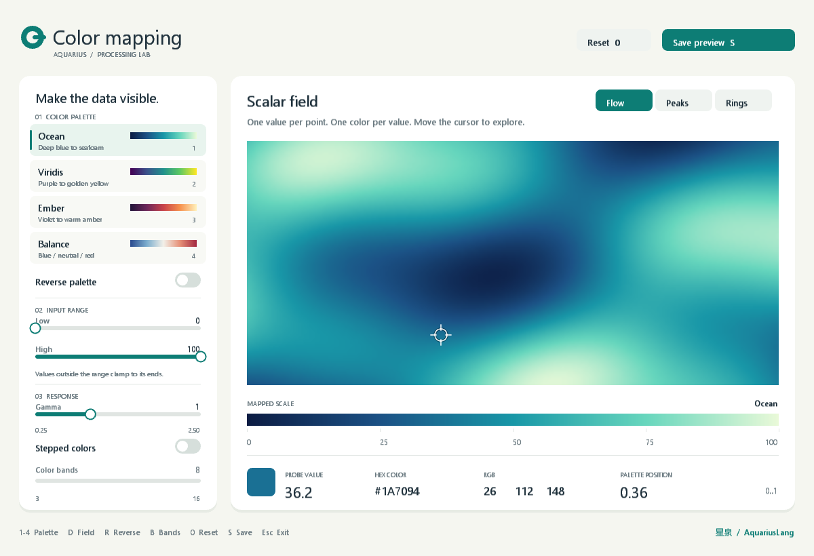

# Aquarius color mapping lab

This directory mirrors the executable example shipped with the desktop VM.
See the [color mapping lab guide](../../AquariusDesktopVMREPL/examples/color_mapping/README.md)
for controls, the mapping pipeline, and verification instructions.



From the repository root:

```powershell
dotnet run --project AquariusDesktopVMREPL -- examples/color_mapping/main.aqua
```
